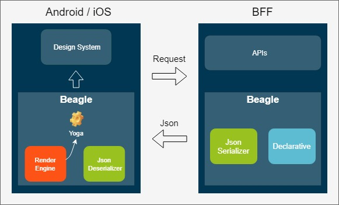

# Beagle

### What is Beagle?

Beagle is a **cross-platform framework** which facilitates usage of the **Server-Driven UI** concept, **natively** in iOS and Android. By using Beagle, your team could easily change application's layout and data by just changing backend code.

### Goals for Beagle

* Automatic app updates without having to rely on App Store or Play Store slow processes
* Easily accommodate changes
* Minimize code duplications
* Easier maintainability and testability
* To be flexible for UI Designers

## How it works

Your application will **define** all UI components it can render \(Design System\) and **register** them inside Beagle. With that, now your BFF \(Backend For Frontend\) will be able to control how your application will be presented by returning a JSON that describes the interface for each endpoint.

#### Beagle Android



#### Beagle iOS



#### Beagle BFF



