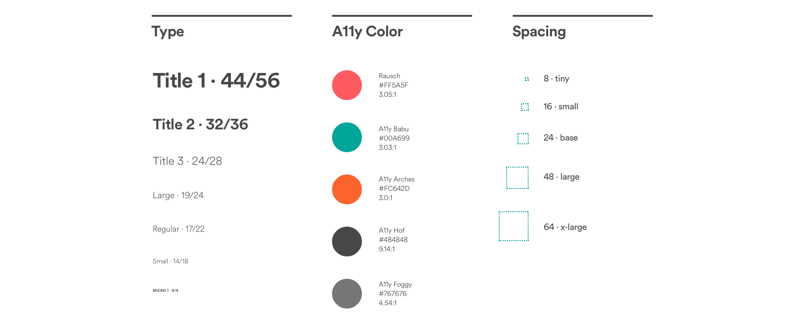

# Overview

## Server-Driven UI


**Server-Driven UI** __is an implementation paradigm that defines how the visual components are settle on a screen, the screen structure and how pages will flow to one another. All this information comes from a server called **Back-end For Front-end** through `JSON` objects. In the Server Driven paradigm the structure and flow between screens is incorporated into the `JSON` objects trafficked with content, which are divided into 3 basic pillars: **content, visual structure and flow \(actions\)**.  
****Check the **Beagle** example on the block below:

```text
{
    "beagleType": "beagle:widget:pageview",
    "pages": [
        {
            "beagleType": "beagle:widget:flexsinglewidget",
            "flex": {
                "justifyContent": "CENTER",
                "alignItems": "CENTER"
            },
            "child": {
                "beagleType": "beagle:widget:text",
                "text": "Page 1"
            }
        },
        {
            "beagleType": "beagle:widget:flexsinglewidget",
            "flex": {
                "justifyContent": "CENTER",
                "alignItems": "CENTER"
            },
            "child": {
                "beagleType": "beagle:widget:text",
                "text": "Page 2"
            }
        },
        {
            "beagleType": "beagle:widget:flexsinglewidget",
            "flex": {
                "justifyContent": "CENTER",
                "alignItems": "CENTER"
            },
            "child": {
                "beagleType": "beagle:widget:text",
                "text": "Page 3"
            }
        }
    ],
    "pageIndicator": {
        "beagleType": "beagle:widget:pageindicator",
        "selectedColor": "#FFFFFF",
        "unselectedColor": "#888888"
    }
}
```

The front-end will set the visual structure and how pages connects and acts on one another natively according to the front-end system.   
As the application sends all actions to the back end, it responds systematically to each action, which configures our “single source of truth”.

In this model the new features  and combinations of UI components can be tested without releases and updates, which practically summarizes an A / B type test. 

Different types of styles and layouts can be tested in certain customer's`circles` , which implies several testing possibilities and Analytics data.

### Backend For Frontend

This is the server that provides the `JSON` objects that will be rendered by the front as `views`. With this component, screens and business rules are written only once and thus rendered natively on each platform that Beagle is present on.

### Declarative Views

It is the paradigm by which the layouts are declared in the back-end, in a simplified way and with a focus on "what" the layout should do, leaving the "how it should do" to Beagle.   
Layouts are declared using widgets on BFF in Kotlin language.  


```text
{
    "beagleType": "beagle:widget:pageview",
    "pages": [
        {
            "beagleType": "beagle:widget:flexsinglewidget",
            "flex": {
                "justifyContent": "CENTER",
                "alignItems": "CENTER"
            },
            "child": {
                "beagleType": "beagle:widget:text",
                "text": "Page 1"
            }
        },
        {
            "beagleType": "beagle:widget:flexsinglewidget",
            "flex": {
                "justifyContent": "CENTER",
                "alignItems": "CENTER"
            },
            "child": {
                "beagleType": "beagle:widget:text",
                "text": "Page 2"
            }
        }
    ],
    "pageIndicator": {
        "beagleType": "beagle:widget:pageindicator",
        "selectedColor": "#FFFFFF",
        "unselectedColor": "#888888"
    }
}

```

### Serializer

The `Beagle serializer` responsibility is converting a declarative layout into a `JSON` object. In order to serialize Kotlin classes into `JSON` objects Beagle will use the [Jackson converter](https://github.com/FasterXML/jackson)_._


To serialize Kotlin classes in JSON objects, Beagle uses _Jackson_.


### Deserializer

The `Beagle deserializer` responsibility is to convert a `JSON` object into a `widget` using [Moshi](https://github.com/square/moshi)_._


On Android _Moshi_ is used for this purpose.



## Design System Language

It is an interface that defines a set of methods that must be implemented to define the **application's theme**. The `appDesignSystem` must keep the button styles, text displays, toolbar styles, images and themes. For Beagle to work according to the application design system, it is necessary to have all of these styles implemented. They will be used the moment the visualization is rendered.



## Layout Engine

When rendering the screen the front-end receives a `JSON` object that provides all necessary information through **Beagle** to position the elements on the screen and deserialize it natively for Android or iOS.

When deserializing, Beagle turns a `widget` into a `view` applying the styles implemented in  the `DesignSystem`. At this point, Beagle uses the [**YOGA**](https://yogalayout.com) rendering engine internally to set the layout's view position and finally render it natively.


